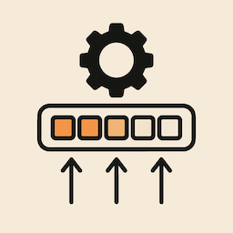

# vec_parallel



A library for building vectors in parallel using async tasks.

This crate provides utilities to construct `Vec<T>` in parallel by dividing the work into
multiple async tasks that can run concurrently. This is particularly useful for CPU-bound
initialization tasks where elements can be computed independently.

## Example

```rust
use vec_parallel::{build_vec, Strategy};

// Build a vector of squares using multiple tasks
let builder = build_vec(100, Strategy::TasksPerCore(4), |i| i * i);

// Run the tasks (in a real application, these would be spawned on an executor)
for task in builder.tasks {
    test_executors::spin_on(task);
}

// Get the final result
let squares = test_executors::spin_on(builder.result);
assert_eq!(squares[10], 100); // 10² = 100
```

## Features

- **Flexible parallelization strategies**: Choose how many tasks to create
- **Zero-copy construction**: Elements are written directly to their final location
- **Executor-agnostic**: Works with any async runtime
- **Optional executor integration**: Use the `some_executor` feature for convenient spawning